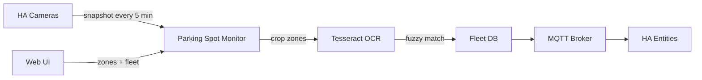

# Parking Spot Monitor — Home Assistant Add-on

Monitor fixed parking spots using camera snapshots and license plate recognition. Designed for fleets where each car has a **number** and **license plate**, and must park in assigned spots for accurate power tracking.

## Features

- **Automatic snapshots** every 5 minutes from your Home Assistant cameras
- **Web UI** (via HA Ingress) to:
  - View live camera snapshots
  - Draw polygon parking zones on each camera
  - Configure your fleet (car number ↔ license plate)
  - See live spot status with confidence scores
- **MQTT entities** auto-discovered in Home Assistant per parking spot:
  - `binary_sensor` — car present (occupied)
  - `sensor` — car number
  - `sensor` — plate text read
  - `sensor` — confidence (%)

## How It Works



1. Snapshots are fetched from configured camera entities
2. Each defined zone is cropped from the image
3. OCR reads license plate text; fuzzy matching links it to your fleet
4. Per-spot state is stored and published via MQTT

## Installation

### Home Assistant (recommended)

1. In Home Assistant go to **Settings → Apps → App store**
2. Click **⋮** (top right) → **Repositories**
3. Add this URL and click **Add**:
   ```
   https://github.com/devilmastah/parking_spot_monitor
   ```
4. Click **Check for updates**
5. Open **Parking Spot Monitor Repository** → install **Parking Spot Monitor**
6. Configure cameras in the add-on options (see below)
7. Start the add-on and open the Web UI

### Local development (Docker)

From the repo root:

```bash
docker compose up --build
```

Or build the add-on image directly:

```bash
docker build -t parking-spot-monitor ./parking_spot_monitor
docker run -p 8099:8099 \
  -e HA_URL=http://your-ha:8123 \
  -e HA_TOKEN=your_long_lived_token \
  -e MQTT_ENABLED=false \
  -v parking_data:/data \
  parking-spot-monitor
```

## Add-on Configuration

| Option | Description | Default |
|--------|-------------|---------|
| `ha_url` | Home Assistant URL | `http://supervisor/core` |
| `snapshot_interval_minutes` | How often to capture & analyze | `5` |
| `mqtt_enabled` | Publish spot entities via MQTT | `true` |
| `mqtt_broker` | MQTT broker hostname | `core-mosquitto` |
| `mqtt_port` | MQTT port | `1883` |
| `mqtt_username` | MQTT username (optional) | |
| `mqtt_password` | MQTT password (optional) | |
| `mqtt_topic_prefix` | Topic prefix for entities | `parking_spot` |
| `cameras` | List of `{entity_id, name}` | `[]` |

### Example camera config

```yaml
cameras:
  - entity_id: camera.parking_lot_a
    name: Parking Lot A
  - entity_id: camera.parking_lot_b
    name: Parking Lot B
```

After saving add-on config, open the Web UI → **Settings** → **Import from Add-on Config**.

## Web UI Setup Guide

### 1. Add cameras
Configure in add-on options or manually under **Settings**.

### 2. Draw parking zones
1. Go to **Zones** tab
2. Select a camera
3. Click **Draw New Zone**
4. Click polygon corners on the snapshot (double-click or click first point to finish)
5. Name the spot (e.g. "Spot 1") and save

### 3. Configure fleet
Under **Fleet**, add each car:
- **Car #** — your internal fleet number (used for power tracking)
- **License Plate** — as printed on the plate (dashes/spaces are normalized)

### 4. Verify
Click **Analyze Now**, then check **Live Status** for occupied/empty, car number, and confidence.

## MQTT Topics

For zone ID `abc12345`:

| Topic | Payload |
|-------|---------|
| `parking_spot/abc12345/occupied` | `ON` / `OFF` |
| `parking_spot/abc12345/car_number` | `3` or `unknown` |
| `parking_spot/abc12345/plate` | Raw OCR text |
| `parking_spot/abc12345/confidence` | `0`–`100` |
| `parking_spot/abc12345/state` | Full JSON state |

Home Assistant MQTT discovery creates entities automatically on first publish.

## OCR Accuracy Tips

License plate OCR is inherently imperfect. For best results:

- **Angle** — mount cameras to see plates clearly when cars are parked
- **Lighting** — avoid glare; IR cameras help at night
- **Zone size** — draw zones tight around the plate area, not the whole car
- **Plate format** — enter fleet plates in a consistent format
- **Confidence** — use the confidence sensor in automations (e.g. only alert if > 70%)

The matcher uses fuzzy string matching, so minor OCR errors (O vs 0, B vs 8) can still match.

## Data Storage

All data persists in `/data` inside the container:

- `parking.db` — zones, fleet, spot states
- `snapshots/` — captured images per camera

## Requirements

- Home Assistant with camera entities
- MQTT broker (Mosquitto add-on recommended) if using MQTT entities
- Cameras must be accessible via HA's `camera_proxy` API

## License

MIT
