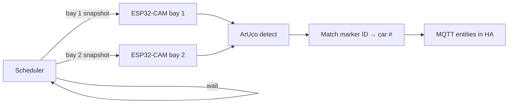

# Parking Spot Monitor — Home Assistant Add-on

Monitor fixed parking bays using **one ESP32-CAM per bay** (ESPHome) and **ArUco markers** on car roofs. Bays are photographed **one at a time** to keep WiFi load manageable.

## How it works



1. Each parking bay has its own ESP32-CAM (ESPHome → `camera.*` entity in HA)
2. The add-on triggers snapshots **sequentially** (configurable delay between bays)
3. OpenCV detects the ArUco marker on the car roof
4. Marker ID is matched to your fleet → car number
5. Results published via MQTT to Home Assistant

## Why this approach

- **Dedicated camera per bay** → close-up, high resolution on the marker
- **ArUco markers** → reliable vs license plate OCR on wide-angle security cams
- **Sequential capture** → avoids overloading WiFi with multiple ESP32 streams at once

## Installation

1. **Settings → Apps → App store → ⋮ → Repositories**
2. Add: `https://github.com/devilmastah/parking_spot_monitor`
3. **Check for updates** → install **Parking Spot Monitor**

## Setup guide

### 1. Flash ESP32-CAM units (ESPHome)

Use the ESPHome config in [`esphome/parking_bay_esp32cam.yaml`](esphome/parking_bay_esp32cam.yaml) — see [`esphome/README.md`](esphome/README.md) for per-bay setup.

- One ESPHome device per bay (unique `name` / `friendly_name`)
- Mount camera overhead or angled at the roof marker spot
- Recommended resolution: `800x600` or higher (with PSRAM)

Generate ArUco markers (must match `aruco_dictionary` in add-on config, default **DICT_4X4_50**):

```bash
python scripts/generate_aruco_markers.py --start 1 --count 10
```

Or manually:

```bash
python3 -c "
import cv2
from cv2 import aruco
d = aruco.getPredefinedDictionary(aruco.DICT_4X4_50)
for i in range(1, 11):
    img = aruco.generateImageMarker(d, i, 200)
    img = cv2.copyMakeBorder(img, 30, 30, 30, 30, cv2.BORDER_CONSTANT, value=255)
    cv2.imwrite(f'aruco_{i}.png', img)
"
```

Print and mount one marker on each car roof (laminated, high contrast).

### 2. Add-on configuration

Example (YAML mode):

```yaml
ha_url: http://supervisor/core
snapshot_interval_minutes: 5
capture_delay_seconds: 3
flash_before_capture: false
aruco_dictionary: DICT_4X4_50
mqtt_enabled: true
mqtt_broker: core-mosquitto
mqtt_port: 1883
mqtt_username: ""
mqtt_password: ""
mqtt_topic_prefix: parking_spot
bays:
  - name: Bay 1
    camera_entity_id: camera.parking_bay_1
  - name: Bay 2
    camera_entity_id: camera.parking_bay_2
```

| Option | Description | Default |
|--------|-------------|---------|
| `snapshot_interval_minutes` | Full round-robin interval | `5` |
| `capture_delay_seconds` | Pause between bay snapshots | `3` |
| `flash_before_capture` | Call ESPHome flash script before snapshot (only needed in low light) | `false` |
| `aruco_dictionary` | OpenCV dictionary name | `DICT_4X4_50` |
| `bays` | List of `{name, camera_entity_id}` | `[]` |

**Capture order** follows `sort_order` in the Web UI (or list order from config).

### 3. Web UI

Open the add-on Web UI:

1. **Settings → Import bays from add-on config**
2. **Fleet → Add car** — car number + ArUco ID (same ID printed on the marker)
3. **Bays → Snapshot** on each bay to verify framing
4. **Analyze all bays** → check **Live Status**

### 4. MQTT entities (per bay)

- `binary_sensor.*_occupied`
- `sensor.*_car_number`
- `sensor.*_aruco_id`
- `sensor.*_confidence`

## Marker tips

- Use **DICT_4X4_50** for up to 50 cars (IDs 0–49)
- Generate markers with the script above — include the **white border** (quiet zone)
- **Print on paper** and mount flat on the roof — do **not** test by showing a marker on a monitor (moire, glare, and skew break detection)
- ESP32-CAM snapshots are often **horizontally mirrored**; v2.2.1+ tries both orientations automatically. You can also set `horizontal_mirror: true` in ESPHome to fix it at the camera
- Marker should fill ~5–15% of the frame width; aim the ESP32-CAM fairly straight down
- Add each car in **Fleet** with the same ArUco ID printed on its marker
- If the dashboard shows **Unknown marker (ID n)** the marker was seen but that ID is not in Fleet
- Good lighting helps; enable `flash_before_capture: true` only for dark bays
- Empty bay = **no marker detected** or confidence **below 50%** → occupied OFF

## Development

```bash
docker compose up --build
```

## License

MIT
